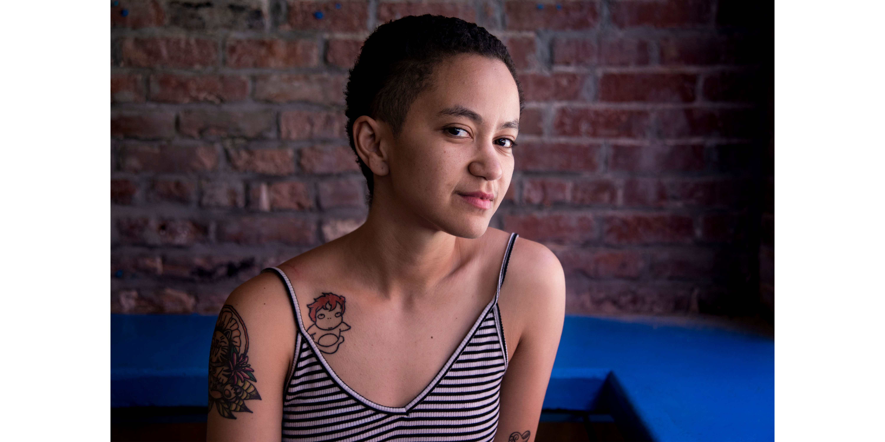

*****

*****
Mia Karisa Dawson is an organizer and geographer based in Sacramento. They organize with #StillHere Collective for Trans Rights as part of a larger coalition of community efforts in the city. Their work approaches the geographies of race, property, and policing as they instersect and structure urban space, and further engages with abolitionist alternatives to these place-making practices. Along their journey as a student, teacher, and organizer, they work to foster and celebrate black, queer, and radical space both within and outside of the university.

Mia Karisa's work has been supported by the Robert & Patricia Switzer Foundation, the Mellon Public Scholars Program, the Mellon Research Initiative on Racial Capitalism, the Society of Women Geographers, the UC Davis Feminist Research Institute, UC Davis Women's Resource and Retention Center, the HATCH Initiative on Feminist Arts and Sciences, and the UC Davis Cross Cultural Center.
