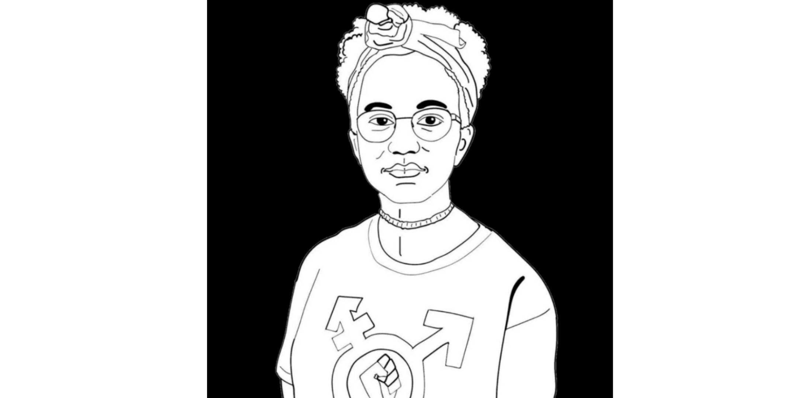

*****

 

*****
I am an organizer and human geographer based in Sacramento. I organize with Decarcerate Sacramento, the UC Davis Violence Prevention Research Program, and Public Health Advocates as part of a larger coalition of community efforts in the city. As a PhD candidate in Geography with a designated emphasis in African American Studies at the Univserity of California, Davis, my work approaches geographies of race, property, and policing as they instersect and structure urban space, and further engages with abolitionist alternatives to these place-making practices. Along my journey as a student, teacher, and organizer, I work to foster and celebrate black, queer, and radical space both within and outside of the university.

My work has been supported by the UC Santa Cruz Visualizing Abolition initiative, the Mellon Public Scholars Program, the Mellon Research Initiative on Racial Capitalism, the Society of Women Geographers, the UC Davis Feminist Research Institute, UC Davis Women's Resource and Retention Center, the HATCH Initiative on Feminist Arts and Sciences, the UC Davis Cross Cultural Center, the UC Davis Humanities Institute, the University of Georgia Community Mapping Lab, and the Robert & Patricia Switzer Foundation.
