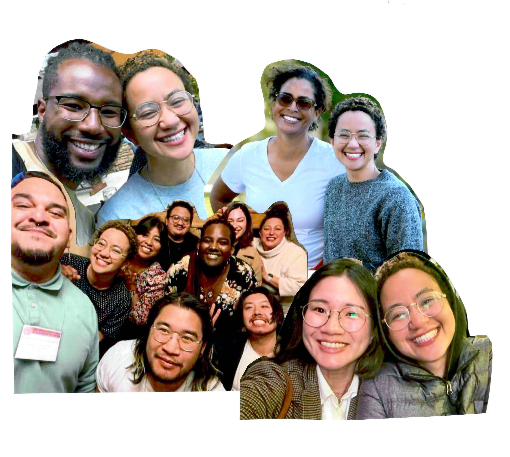

*****

 
*Myself with mentor Dr. Kelly Lytle Hernández and other beloved UC President's & Chancellor's Postdoctoral Fellows*

*****
I'm Mia Karisa Dawson, an urban human geographer and community organizer. Since recieving my doctorate in Geography in 2023 from the University of California, Davis, I've been awarded a Chancellor’s Postdoctoral Fellow in the Department of History at the University of California, Los Angeles and a Postdoctoral Fellowship for Faculty Diversity in the Department of Geography at the University of Maryland, Baltimore County. I study racial relationships of policing, property, and protest that shape U.S. cities with a focus in Sacramento. I work in advocacy to develop approaches to housing and violence prevention by and for people. I have a background in environmental justice, and I've participated in research and advocacy surrounding racial disparities in air and water quality in California.

My work has been published in journals including *Urban Geography*, *EPD: Society and Space*, *Frontiers in Public Health*, *ACME: An International Journal for Critical Geographies*, and *Water Alternatives*. 

I am inspired and motivated by many beautiful friends and organizers including but not limited to those pictured above.

