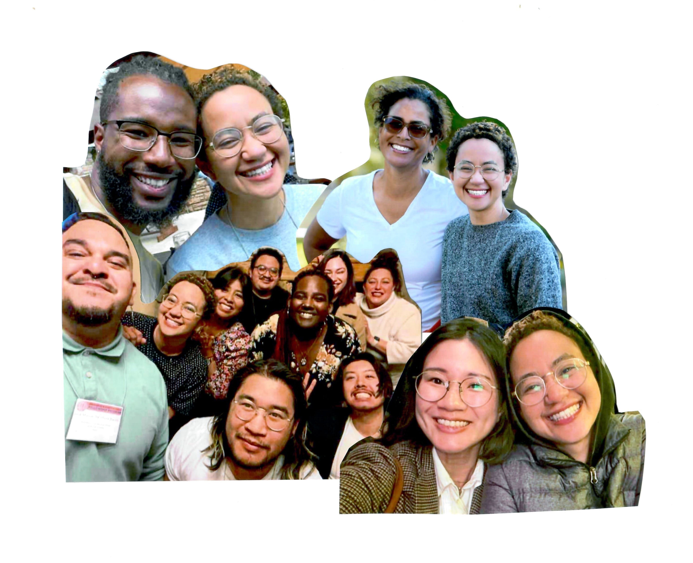

*****

 
*Myself, mentor Dr. Kelly Lytle Hernández, and assorted queers of the UC President's & Chancellor's Postdoctoral Fellowships (Spring 2024)*

*****
I'm Mia Karisa Dawson, an organizer, writer, and urban human geographer. I'm a 2023-2024 Chancellor's Postdoctoral Fellow at the University of California, Los Angeles. I study relationships of race, property, and policing in cities. I further explore social movements that revolutionize cities through direct action, mutual aid, and mass movement.

I've been supported by organizations including the Mellon Research Initiative on Racial Capitalism, the UC Santa Cruz Visualizing Abolition program, the UC Davis Feminist Research Institute, the UC Davis Humanities Research Institute, the Society of Women Geographers, the Mellon Public Scholars Program, and the Robert and Patricia Switzer Foundation. I've also been supported by my beautiful friends and revolutionaries.
