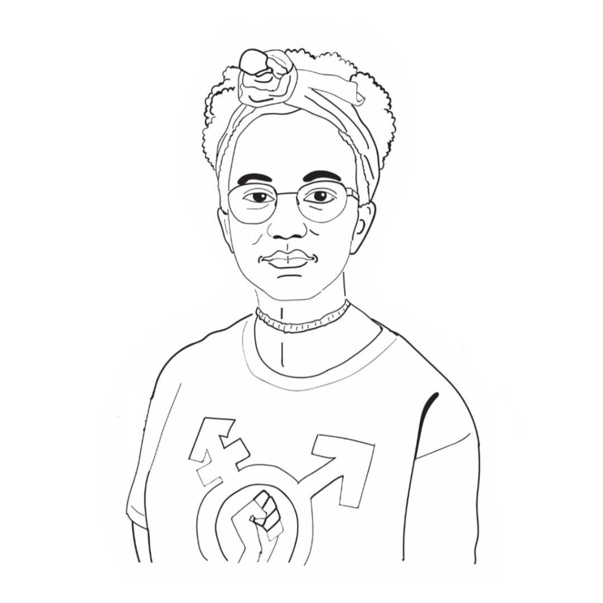

*****

 

*****
I'm Mia Karisa Dawson, an organizer, writer, and urban human geographer. I'm a 2023-2024 Chancellor's Postdoctoral Fellow at the University of California, Los Angeles. I study relationships of race, property, and policing in cities. I further explore social movements that revolutionize cities through direct action, mutual aid, and mass movement. 

I've been published in journals including EPD: Society and Space and Frontiers in Public Health and have been supported by organizations including the Mellon Research Initiative on Racial Capitalism, the UC Santa Cruz Visualizing Abolition program, the Society of Women Geographers, the American Association of Geographers, the Mellon Public Scholars Program and the University of Georgia Community Mapping Lab.
